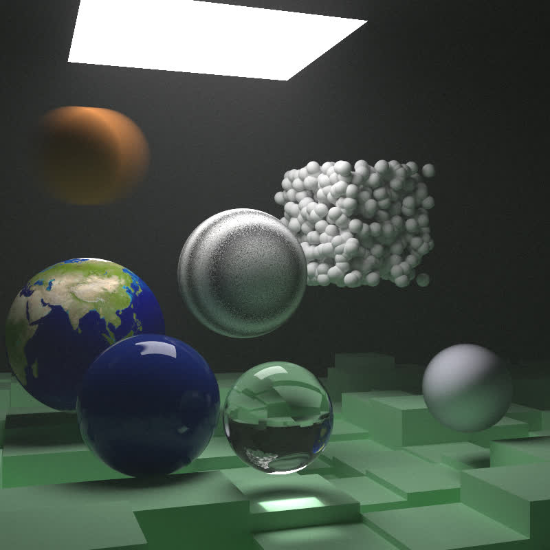

Yet another raytracer written in haskell

Hardware: ryzen 4700u, gpu not used
Final render stats: check executionStats.txt

To run:
cabal build && cabal run tracerays -- 7 800 5000 40 +RTS -s -N8 -RTS

I took some inspiration with the smoke effect and the idea of using a "deterministic random" in the smoke effect

by this project. It was either that or use monad transformers which is excruciating slow
[_icrainbow's rtow_](https://gitlab.com/dpwiz/rtow/)

referenced
 
[_Ray Tracing in One Weekend_](https://raytracing.github.io/books/RayTracingInOneWeekend.html)

[_Ray Tracing: The Next Week_](https://raytracing.github.io/books/RayTracingTheNextWeek.html)

